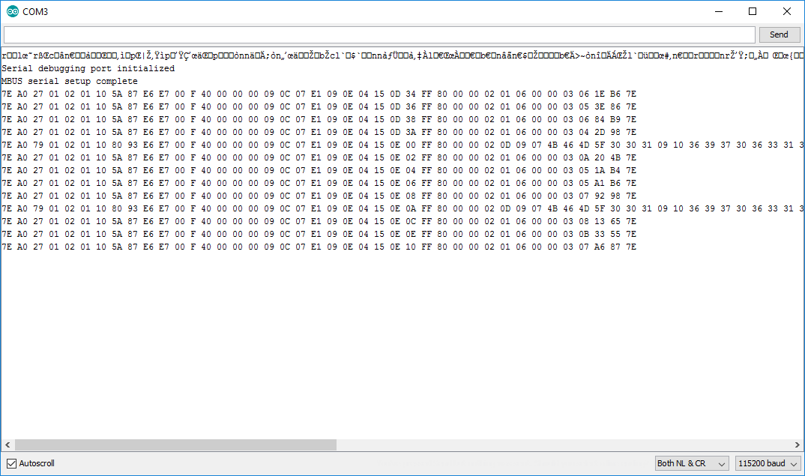
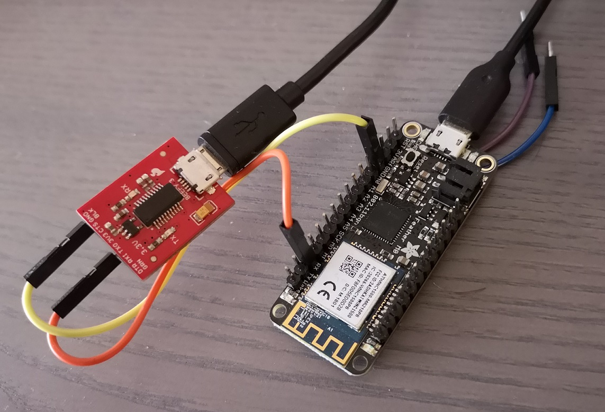

## AMS <-> MQTT Bridge
# Code

Various code projects to help debug and build the final system

### HanDebugger (C# console)
A very simplified c# console application to read serial data directly from the HAN bus, using the HAN-FTDI circuit and a FTDI device (USB serial port). The application will simply use the right serial setup (2400 baud, 8E1) to set up a connection and continously read incoming data. The received data is split on the package start and -end flags (0x7E) and output to console.

### ESPDebugger (Arduino sketch on ESP8266)
Very similar to the HanDebugger, simply reading the HAN data and outputting the same data to the Serial1 port, HEX-formatted and splitted by lines on start and -end flags.

.jpg)

### SerialTestPattern (Arduino sketch, any variant)
This code outputs a changing serial test pattern.

### SerialSimulator (Python code to send sample HAN data over serial port)

Use this Python3 script (e.g. running on a desktop computer using a USB to serial dongle) to simulate the data sent over the HAN port (after being translate from Mbus to uart signals).

