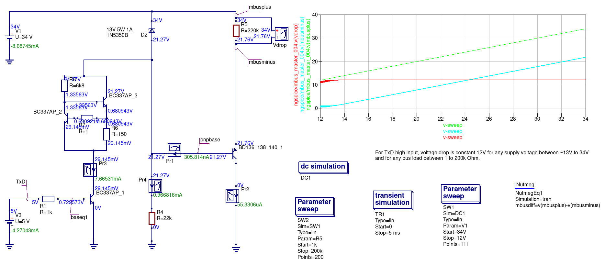

This directory contains various simulation of the M-Bus part of [MBus_USB.pdf](../doc/MBus_USB.pdf?raw=true).
The simulattions are done with [qucs-s](https://ra3xdh.github.io/) using [ngspice](http://ngspice.sourceforge.net)
as simulation backend.

The first simulation is as close to the original as possible and gradulally changed to
remove receiving parts and using a zener diode to have a constant 12V voltage drop
regardless of the power supply. The final version works with any voltage in M-Bus range.

