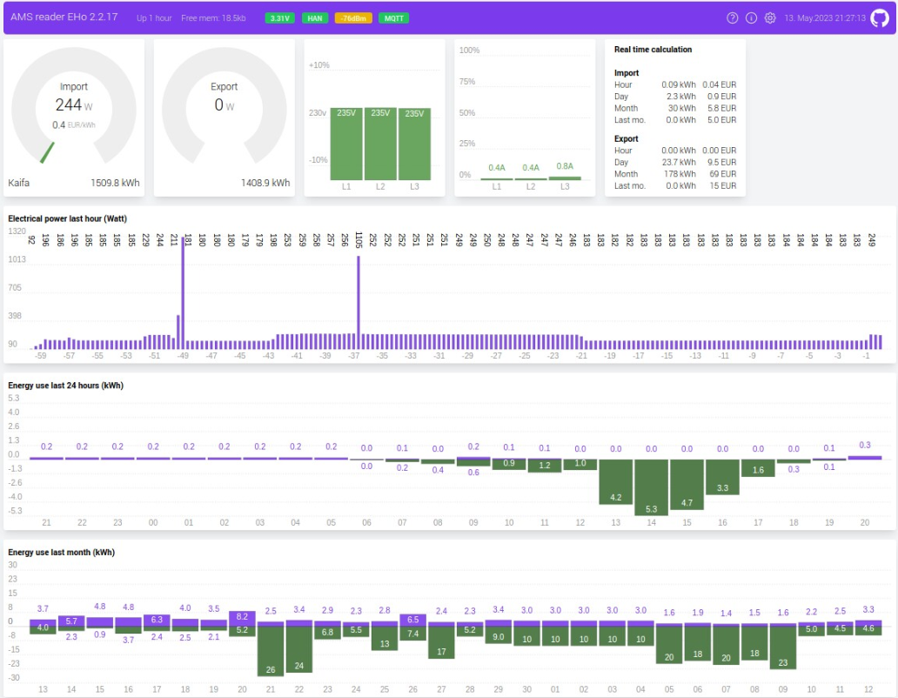

# AMS2MQTTBridge-EHo
This is a fork from amsreader-firmware (old name: AmsToMqttBridge) amsreader-firmware based on Rev 2.2.17 (dated 5th Mai 2023)

Because of memory limitations for ESP8266 which made OTA firmware update impossible I had to delete the automatic firmware detection/download/consent. So this firmware can only be updated via status web page (Upload Firmware) or by using direct serial connection to ESP device.

Now features:
1) All functions from amsreader-firmware Rev 2.2.17
2) Added a 60 Minute plot (180 point resolution, 1 pt each 20 sec)
3) Exported energy is shown in green color on hour, day and month plot.
4) Automatic Wifi swapping if configured WLAN does not connect. See below for more info.
5) Disabled automatic FW update info (soon...)
6) Some minor color changes on dashboard gauges
7) Translation to German language are now in branch "german"


## Wifi function (STA mode or AP mode):
The option on configuration page in section Wifi called:  "Start a Wifi AP on home Wifi connection problem" will enable this:
If the configured Wifi (should be your home Wifi) can not be reached within app. 2 minutes software will swap to Wifi AP mode and will present a AP named "amsreader-abcd" with **password: amsreader_config** so one can acess the web pages on its default IP: 192.168.4.1

Software will try to re-connect to the configured Wifi if no client is connected to this AP for 90 seconds. So if one is connected to AP Wifi the device will stay in AP mode. Please mind that most devices will do a automatic reconnect to the AP Wifi if the Wifi connection "amsreader-abcd" was once used. This could prevent the ESP32 from automatically reconnecting to defined STA Wifi.

"AP" button still is an option to swap between configured WLAN and an Wifi Access point called "amsreader-abcd". The AP button must be pressed longer than 5 seconds to swap Wifi mode.


## Original README.md from amsreader-firmware:

This code is designed to decode data from electric smart meters installed in many countries in Europe these days. The data is presented in a graphical web interface and can also send the data to a MQTT broker which makes it suitable for home automation project. Originally it was only designed to work with Norwegian meters, but has since been adapter to read any IEC-62056-7-5 or IEC-62056-21 compliant meters.

Later development have added Energy usage graph for both day and month, as well as future energy price (Prices only  available for ESP32). The code can run on any ESP8266 or ESP32 hardware which you can read more about in the [WiKi](https://github.com/gskjold/AmsToMqttBridge/wiki). If you don't have the knowledge to set up a ESP device yourself, have a look at the shop at [amsleser.no](https://amsleser.no/).




Go to the [WiKi](https://github.com/gskjold/AmsToMqttBridge/wiki) for information on how to get your own device! And find the latest prebuilt firmware file at the [release section](https://github.com/gskjold/AmsToMqttBridge/releases).

## Building this project with PlatformIO
To build this project, you need [PlatformIO](https://platformio.org/) installed.

It is recommended to use Visual Studio Code with the PlatformIO plugin for development.

[Visual Studio Code](https://code.visualstudio.com/download)

[PlatformIO vscode plugin](https://platformio.org/install/ide?install=vscode)

For development purposes, copy the ```platformio-user.ini-example``` to ```platformio-user.ini``` and customize to your preference. The code will adapt to the platform and board set in your profile.
