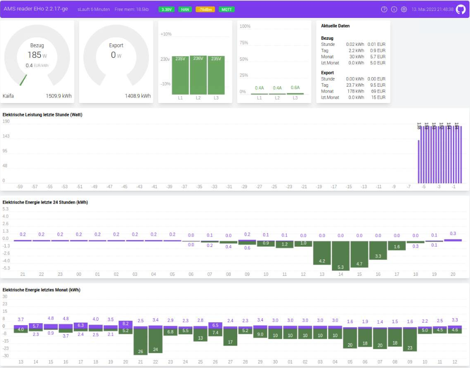

# AMS Reader
This code is designed to decode data from electric smart meters installed in many countries in Europe these days. The data is presented in a graphical web interface and can also send the data to a MQTT broker which makes it suitable for home automation project. Originally it was only designed to work with Norwegian meters, but has since been adapter to read any IEC-62056-7-5 or IEC-62056-21 compliant meters.

Later development have added Energy usage graph for both day and month, as well as future energy price. The code can run on any ESP8266 or ESP32 hardware which you can read more about in the [WiKi](https://github.com/UtilitechAS/amsreader-firmware/wiki). If you don't have the knowledge to set up a ESP device yourself, have a look at the shop at [amsleser.no](https://amsleser.no/).




Go to the [WiKi](https://github.com/UtilitechAS/amsreader-firmware/wiki) for information on how to get your own device! And find the latest prebuilt firmware file at the [release section](https://github.com/UtilitechAS/amsreader-firmware/releases).

## Building this project with PlatformIO
To build this project, you need [PlatformIO](https://platformio.org/) installed.

It is recommended to use Visual Studio Code with the PlatformIO plugin for development.

[Visual Studio Code](https://code.visualstudio.com/download)

[PlatformIO vscode plugin](https://platformio.org/install/ide?install=vscode)

For development purposes, copy the ```platformio-user.ini-example``` to ```platformio-user.ini``` and customize to your preference. The code will adapt to the platform and board set in your profile.
