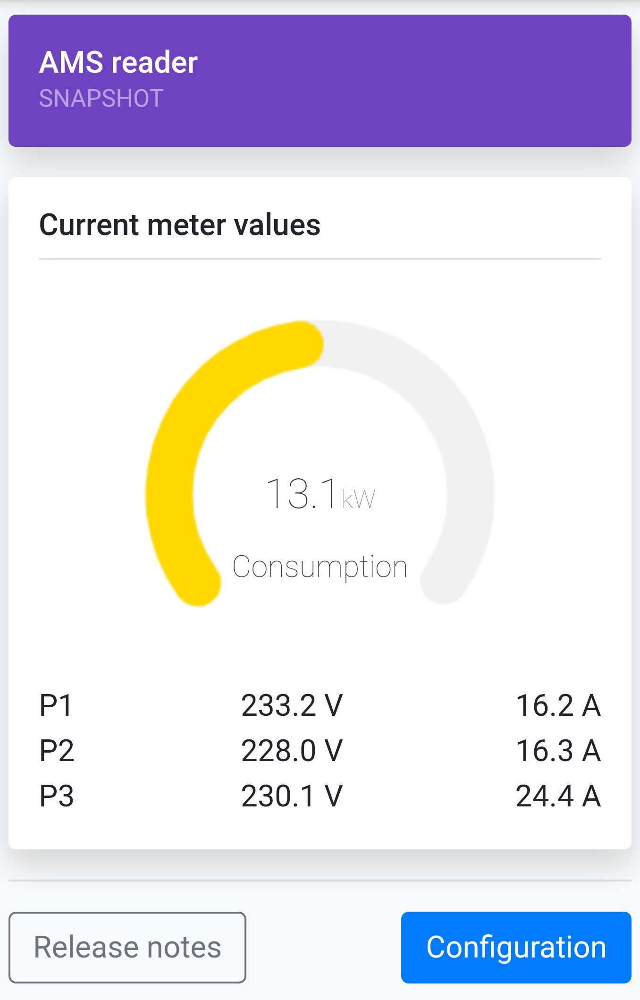

# AMS <-> MQTT Bridge
Orignally designed and coded by [@roarfred](https://github.com/roarfred), see the original repo at [roarfred/AmsToMqttBridge](https://github.com/roarfred/AmsToMqttBridge)

This repository contains the code and schematics necessary to build a device to receive and convert data from AMS electrical meters installed in Norway. The code can be used on both ESP8266 and ESP32, both as custom build devices or built from readily available development modules. It reads data from the HAN port of the meter and sends this to a configured MQTT bus.

There is also a web interface available on runtime, showing meter data in real time.



## Hardware options
Look in [hardware section](/hardware) for more details about supported hardware

## Release binaries

In the [Release section](https://github.com/gskjold/AmsToMqttBridge/releases) of this repository, you will find precompiled binaries for ESP8266 and ESP32 boards.


### Flashing binaries with [esptool.py](https://github.com/espressif/esptool)

Linux:
```esptool.py --port /dev/ttyUSB0 write_flash 0x0 firmware.bin```

Windows:
```esptool.py --port COM1 write_flash 0x0 firmware.bin```

With ESP32 it is a bit more complicated:
```esptool.py --chip esp32 --port /dev/ttyUSB0 --baud 460800 --before default_reset --after hard_reset write_flash -z --flash_mode dio --flash_freq 40m --flash_size detect 0x1000 bootloader.bin 0x8000 partitions.bin 0x10000 firmware.bin```

Get the bootloader here: [Arduino ESP32 bootloader](https://github.com/espressif/arduino-esp32/tree/master/tools/sdk/bin) The default bootloader is [bootloader_dio_40m.bin](https://github.com/espressif/arduino-esp32/raw/master/tools/sdk/bin/bootloader_dio_40m.bin)


## Building this project with PlatformIO
To build this project, you need [PlatformIO](https://platformio.org/) installed.

It is recommended to use Visual Studio Code with the PlatformIO plugin for development.

[Visual Studio Code](https://code.visualstudio.com/download)

[PlatformIO vscode plugin](https://platformio.org/install/ide?install=vscode)

Copy the ```platformio-user.ini-example``` to ```platformio-user.ini``` and customize to your preference. The code will adapt to the platform and board set in your profile. If you are using the original board design by [@roarfred](https://github.com/roarfred) use build flag -D HW_ROARFRED=1