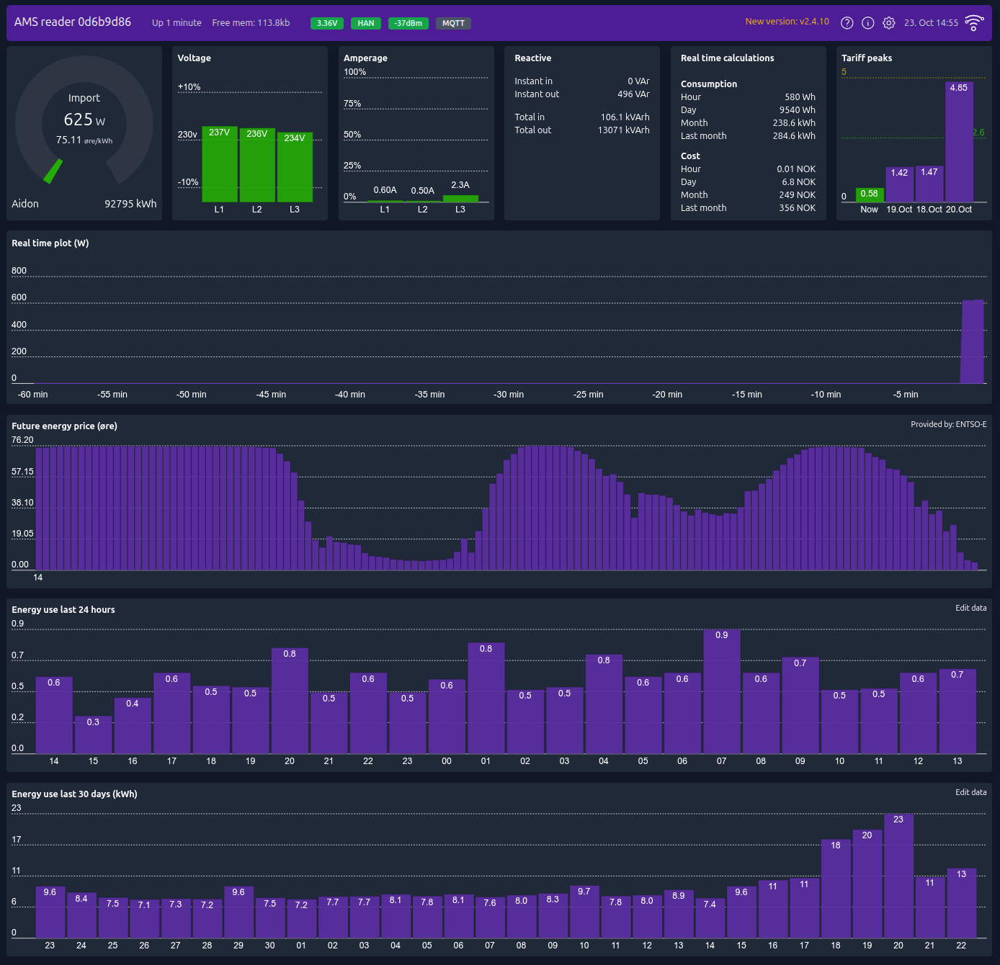

# AMS Reader
This code is designed to decode data from electric smart meters installed in many countries in Europe these days. The data is presented in a graphical web interface and can also send the data to a MQTT broker which makes it suitable for home automation project. Originally it was only designed to work with Norwegian meters, but has since been adapter to read any IEC-62056-7-5 or IEC-62056-21 compliant meters.

Later development have added Energy usage graph for both day and month, as well as future energy price. The code can run on any ESP8266 or ESP32 hardware which you can read more about in the [WiKi](https://github.com/UtilitechAS/amsreader-firmware/wiki). If you don't have the knowledge to set up a ESP device yourself, or you would like to support our work, please have a look at our shop at [amsleser.no](https://amsleser.no/).




Go to the [WiKi](https://github.com/UtilitechAS/amsreader-firmware/wiki) for information on how to get your own device! And find the latest prebuilt firmware file at the [release section](https://github.com/UtilitechAS/amsreader-firmware/releases).

## Building this project with PlatformIO
To build this project, you need [PlatformIO](https://platformio.org/) installed.

It is recommended to use Visual Studio Code with the PlatformIO plugin for development.

[Visual Studio Code](https://code.visualstudio.com/download)

[PlatformIO vscode plugin](https://platformio.org/install/ide?install=vscode)

For development purposes, copy the ```platformio-user.ini-example``` to ```platformio-user.ini``` and customize to your preference. The code will adapt to the platform and board set in your profile.

## Licensing
Initially, this project began as a hobby, consuming countless hours of our spare time. However, the time required to support this project has expanded beyond the scope of a hobby. As a result, we established ‘Utilitech’, a company dedicated to maintaining the software and hardware for this project as part of our regular work.

To ensure the sustainability of our venture, we have opted to license our software under the [Fair Source License] (https://fair.io). This approach allows the software to remain free for personal use, while also ensuring full transparency of our code’s inner workings. It also prevents competitors from exploiting our work without contributing to the maintenance of the code or providing technical support to end users.

For more information, please refer to our [LICENSE](/LICENSE) file.

If your usage falls outside the scope of this license and you require a separate license, please contact us at [post@utilitech.no](mailto:post@utilitech.no) for further details.


{#if configuration.n.c == 1 || configuration.n.c == 2}
                <div class="my-1">
                    {translations.conf?.connection?.ssid ?? "Nettverksnavn (SSID)"}
                    <br/>
                    {#if networks?.c == -1}
                        <div class="text-sm italic">Søker etter Nettverk...</div>
                    {/if}
                    {#if networks?.n?.length}
                        <ul class="border rounded divide-y">
                            {#each networks.n as network, index}
                                <li>
                                    <label class="flex items-center px-2 py-1 cursor-pointer hover:bg-gray-100">
                                        <input
                                            type="radio"
                                            class="mr-2"
                                            name="ws-option"
                                            value={network.s}
                                            bind:group={configuration.w.s}/>
                                        <span class="flex items-center justify-between w-full">
                                            <span>{network.s}</span>
                                            
                                        </span>
                                    </label>
                                </li>
                            {/each}
                        </ul>
                    {:else if networks?.c != -1}
                        <div class="text-sm italic">Ingen nettverk funnet</div>
                    {/if}
                </div>
                <div class="my-1">
                    {translations.conf?.connection?.psk ?? "Passord"}<br/>
                    <input name="wp" bind:value={configuration.w.p} type="password" class="in-s" pattern={asciiPatternExt}/>
                </div>
                <div class="my-1 flex">
                    <div class="w-1/2">
                        {translations.conf?.connection?.ps?.title ?? "Power saving"}<br/>
                        <select name="wz" bind:value={configuration.w.z} class="in-s">
                            <option value={255}>{translations.conf?.connection?.ps?.default ?? "Default"}</option>
                            <option value={0}>{translations.conf?.connection?.ps?.off ?? "Off"}</option>
                            <option value={1}>{translations.conf?.connection?.ps?.min ?? "Min"}</option>
                            <option value={2}>{translations.conf?.connection?.ps?.max ?? "Max"}</option>
                        </select>
                    </div>
                    <div class="ml-2 w-1/2">
                        {translations.conf?.connection?.pwr ?? "Power"}<br/>
                        <div class="flex">
                            <input name="ww" bind:value={configuration.w.w} type="number" min="0" max="20.5" step="0.5" class="in-f tr w-full"/>
                            <span class="in-post">dBm</span>
                        </div>
                    </div>
                </div>
                <div class="my-3">
                    <label><input type="checkbox" name="wb" value="true" bind:checked={configuration.w.b} class="rounded mb-1"/> {translations.conf?.connection?.tick_11b ?? "802.11b"}</label>
                </div>
            {/if}