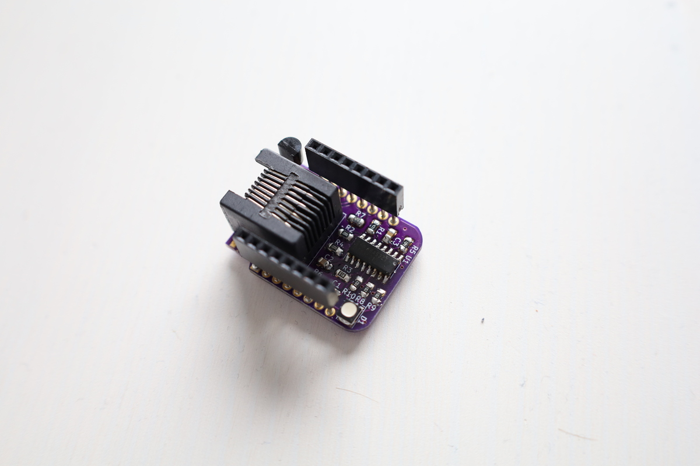

## Wemos shield

Fits D1 mini and S2 mini.

**WARNING** Not properly tested

**Resistors**
- R1:  470 (for U1)
- R2:  220 (for U1)
- R3:  82k (for U1)
- R4:  220 (for U1)
- R5: 100k (for U1)
- R6:  10k (for AP button)
- R7: 4.7k (for DS18B20)
- R8-R10: 1k (for RGB LED)

**Capacitors**
- C1: 100n (for U1)
- C2: 1u (for U1)
- C3: 100n (for U1)

**Other components**
- U1: TSS521 or TSS721
- U2: DS18B20 (Digital temperature sensor)
- D1: RGB LED
- J1: RJ45
- SW1: AP button (to D3 GPIO0)

**Jumper**
- JP1 & JP4: Jump these to receive power (5V) via RJ45 on pin 7 (GND) and 8 (+5)
- JP2 & JP3: Jump these to attach DS18B20 sensors via RJ45 on pin 4 (Data) and pin 5 (GND)
